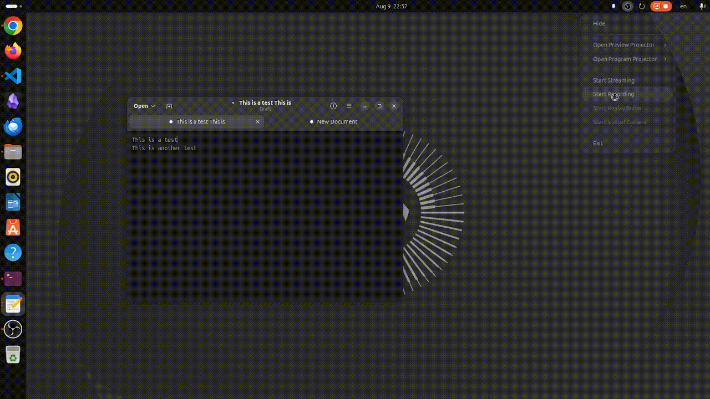

#  ClipDeck

A clipboard manager for Linux, inspired by [Ditto](https://ditto-cp.sourceforge.io/) for Windows.
A Rust daemon captures clipboard history in the background — independent of any UI — and a
Tauri + React desktop app gives you fuzzy/full-text search over that history via a global hotkey,
Enter-to-paste back into whatever window you were just in.


<!-- TODO: replace with an actual screen recording of the hotkey popup + manager in action -->

## Contents

- [Architecture](#architecture)
- [Prerequisites](#prerequisites)
- [Quick install](#quick-install)
- [Building](#building)
- [Running in development](#running-in-development)
- [Installing `clipd` as a background daemon](#installing-clipd-as-a-background-daemon)
- [Installing the desktop app](#installing-the-desktop-app)
- [Configuration](#configuration)
- [Testing](#testing)
- [Uninstalling](#uninstalling)
- [Troubleshooting](#troubleshooting)

## Architecture

```text
clip-ui (Tauri 2, popup/manager/tray)  <--IPC (Unix socket)-->  clipd (Rust daemon)
                                                                       |
                                                                       v
                                                          SQLite + FTS5, blob store on disk
```

`clipd` owns every OS-sensitive integration — clipboard capture, the global hotkey, focused-window
detection, and synthetic paste — so history keeps recording even if the desktop app is closed or
crashes. The desktop app is a thin client that talks to `clipd` over a local Unix domain socket; it
never touches the clipboard, database, or hotkey grab directly.

The Cargo workspace is split into six crates:

| Crate            | Responsibility                                                                 |
|-------------------|--------------------------------------------------------------------------------|
| `clip-core`       | Shared domain models, MIME normalization, content hashing, config             |
| `clip-store`      | SQLite persistence — schema, FTS5 search sync, retention                      |
| `clip-platform`   | Linux integration: X11 (primary) and Wayland adapters, hotkeys, focus, paste  |
| `clip-ipc`        | The daemon↔UI protocol over a Unix socket                                     |
| `clipd`           | The daemon binary — capture loop, IPC server, background jobs                 |
| `clip-ui-tauri`   | The Tauri 2 + React/TypeScript desktop app (popup, manager, settings, tray)   |

## Prerequisites

- **Rust** (stable) and Cargo — [rustup.rs](https://rustup.rs/)
- **Node.js** (18+) and npm, for the frontend
- **Tauri's Linux system dependencies**:
  ```sh
  sudo apt install pkg-config libgtk-3-dev libwebkit2gtk-4.1-dev libayatana-appindicator3-dev librsvg2-dev
  ```
- **The Tauri CLI**, as a Cargo subcommand:
  ```sh
  cargo install tauri-cli --version "^2"
  ```
- A graphical session (X11, or Wayland with XWayland available). `clipd` prefers a direct X11
  connection whenever one is reachable — which covers most Wayland desktops too, since they run
  XWayland underneath — and only falls back to its native Wayland (`wlr-data-control`) adapter when
  no X11 connection can be made at all. Global hotkeys additionally require either a real X11
  session or a GNOME-based Wayland compositor (see [Troubleshooting](#troubleshooting)).

## Quick install

`scripts/install.sh` automates everything in
[Installing `clipd` as a background daemon](#installing-clipd-as-a-background-daemon) and
[Installing the desktop app](#installing-the-desktop-app) below in one step: it builds and
installs `clipd`/`clip-hotkey-trigger` onto `$PATH`, writes and enables the systemd `--user`
service, then builds the desktop app and installs it as a `.deb`.

```sh
./scripts/install.sh
```

Pass `--daemon-only` to install just the background daemon (e.g. on a machine without a desktop
environment), or `--ui-only` to build and install just the desktop app package against a `clipd`
already installed elsewhere. Run `./scripts/install.sh --help` for details. The sections below
explain what it does and how to perform each step by hand — useful for troubleshooting, or if you'd
rather control the process yourself.

## Building

Clone the repository, then build the Rust workspace:

```sh
cargo build --workspace --release
```

This produces two daemon-side binaries under `target/release/`:

- `clipd` — the daemon itself
- `clip-hotkey-trigger` — a tiny helper invoked by GNOME's custom-keybinding mechanism on Wayland;
  it just forwards a "hotkey pressed" signal to a running `clipd` over the socket and exits

Install the frontend's dependencies separately:

```sh
cd crates/clip-ui-tauri
npm install
```

## Running in development

**1. Start the daemon** in its own terminal (it stays in the foreground and logs to stdout):

```sh
cargo run -p clipd
```

It creates its SQLite database and Unix socket under the standard XDG paths on first run — see
[Configuration](#configuration) for exactly where.

**2. Run the desktop app** against that daemon:

```sh
cd crates/clip-ui-tauri
cargo tauri dev
```

This starts the Vite dev server and launches the Tauri app, which connects to `clipd`'s socket on
startup — it will fail to launch if the daemon isn't already running. Copy something to trigger a
capture, then press the configured hotkey (`Ctrl+Shift+V` by default) to open the search popup.

## Installing `clipd` as a background daemon

For everyday use you want `clipd` running in the background permanently, starting automatically at
login, restarting itself if it ever crashes — independent of whether the desktop app is open. A
`systemd` user service does exactly that.

**1. Build and install the daemon binaries** onto your `PATH`:

```sh
cargo install --path crates/clipd
```

This installs both `clipd` and `clip-hotkey-trigger` into `~/.cargo/bin` (make sure that directory
is on your `PATH` — it usually already is if you installed Rust via `rustup`). Installing them
together, in the same directory, matters: `clipd` locates `clip-hotkey-trigger` as a sibling of its
own executable when it registers the GNOME fallback hotkey path.

**2. Create the unit file** at `~/.config/systemd/user/clipd.service`:

```ini
[Unit]
Description=ClipDeck clipboard daemon
After=graphical-session.target

[Service]
ExecStart=%h/.cargo/bin/clipd
Restart=on-failure
RestartSec=2

[Install]
WantedBy=graphical-session.target
```

**3. Reload, enable, and start it**:

```sh
systemctl --user daemon-reload
systemctl --user enable --now clipd.service
```

**4. Verify it's running**:

```sh
systemctl --user status clipd.service
journalctl --user -u clipd.service -f
```

From now on, `clipd` starts automatically every time you log in, and `systemd` restarts it if it
ever exits unexpectedly. To stop or restart it manually:

```sh
systemctl --user stop clipd.service
systemctl --user restart clipd.service
```

> **Note on `DISPLAY`/`WAYLAND_DISPLAY`:** `systemd --user` units only inherit these environment
> variables if your desktop environment exports them into the systemd user session (GNOME and KDE
> do this by default on modern Ubuntu). If `clipd` fails to connect to a display when started this
> way but works fine from an interactive terminal, add the values explicitly to the unit's
> `[Service]` section, e.g. `Environment=DISPLAY=:0` and/or `Environment=WAYLAND_DISPLAY=wayland-0`
> (check the correct values with `echo $DISPLAY $WAYLAND_DISPLAY` in your desktop session).

## Installing the desktop app

Once `clipd` is installed and running, build an installable package for the desktop app:

```sh
cd crates/clip-ui-tauri
cargo tauri build
```

This produces a `.deb` package and an AppImage under
`crates/clip-ui-tauri/src-tauri/target/release/bundle/`. Install the `.deb` with:

```sh
sudo apt install ./crates/clip-ui-tauri/src-tauri/target/release/bundle/deb/*.deb
```

This registers a normal `ClipDeck` application entry (with tray icon) in your desktop's application
menu. Launch it like any other app — it will connect to the `clipd` service you installed above.

## Configuration

`clipd` resolves its config, data, and cache directories via the standard XDG base directories:

| Purpose                          | Default location                     | Override               |
|-----------------------------------|---------------------------------------|--------------------------|
| Unix socket, general config       | `~/.config/clipdeck/`                | `CLIPDECK_CONFIG_DIR`  |
| SQLite database, blob store       | `~/.local/share/clipdeck/`           | `CLIPDECK_DATA_DIR`    |
| Cache                              | `~/.cache/clipdeck/`                  | `CLIPDECK_CACHE_DIR`   |

All three can also be redirected at once, as sibling subdirectories of one root, with
`CLIPDECK_TEST_HOME` — handy for a fully sandboxed run that never touches your real clipboard
history. `clipd` loads a `.env` file (searched upward from the current directory) at startup via
`dotenvy`, if present; see `.env.example` for a template. In-app settings (hotkey binding, retention
window, default paste mode, capture-paused) are stored in the SQLite database itself and are
editable from the desktop app's Settings window.

## Testing

```sh
cargo test --workspace              # all Rust crates
cd crates/clip-ui-tauri && npm test # frontend (Vitest)
```

Some Rust tests are `#[ignore]`d because they require a live X11/Wayland session rather than a fake
connection; run them explicitly on a machine that has one:

```sh
cargo test --workspace -- --ignored
```

## Uninstalling

```sh
systemctl --user disable --now clipd.service
rm ~/.config/systemd/user/clipd.service
systemctl --user daemon-reload
cargo uninstall clipd
sudo apt remove clipdeck   # if you installed the .deb
rm -rf ~/.config/clipdeck ~/.local/share/clipdeck ~/.cache/clipdeck
```

## Troubleshooting

- **`clipd` exits immediately with "another instance is already running"**: a previous `clipd`
  (or a stale socket file) is still bound to `~/.config/clipdeck/clipd.sock`. Check
  `systemctl --user status clipd.service` / `ps aux | grep clipd` before deleting the socket file
  by hand.
- **The desktop app fails to launch with "failed to connect to clipd"**: `clipd` isn't running, or
  is running under a different `CLIPDECK_CONFIG_DIR` than the app expects. Confirm both processes
  resolve the same config directory.
- **Global hotkey doesn't do anything on Wayland**: on GNOME/Mutter, Wayland never forwards global
  key grabs to XWayland clients, so `clipd` registers the hotkey as a GNOME custom keybinding
  instead (running `clip-hotkey-trigger` on keypress). Confirm `clip-hotkey-trigger` is on the same
  `PATH`-resolvable directory as `clipd`, and check GNOME Settings → Keyboard → Custom Shortcuts for
  the registered binding. Non-GNOME Wayland compositors do not have an equivalent fallback yet.
- **No new clips ever appear**: check `journalctl --user -u clipd.service` for capture errors, and
  confirm `GetDiagnostics` reports a backend with `capture: true` (Settings → Diagnostics in the
  desktop app).

## License

MIT — see [LICENSE](LICENSE).
